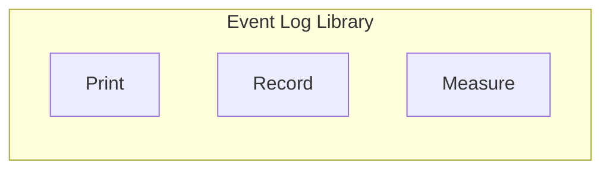
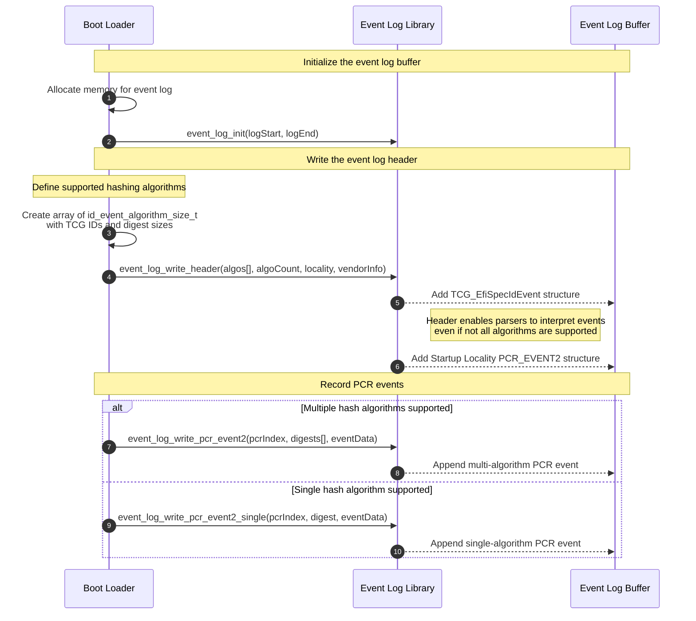
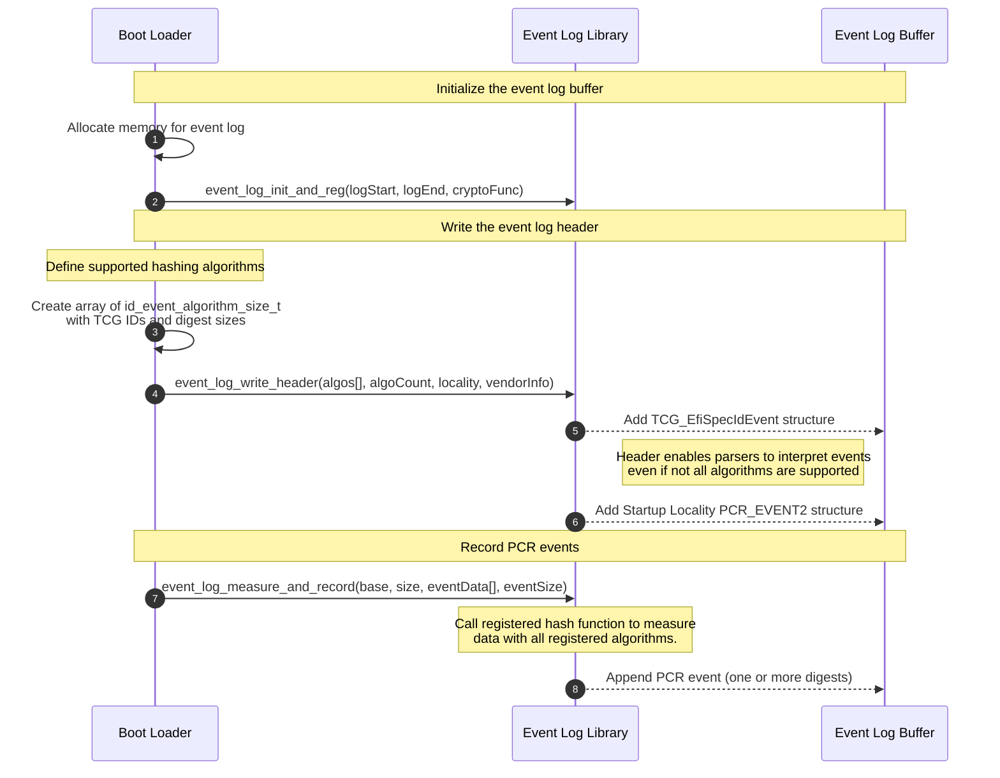

# Event Log Library (LibEventLog)

LibEventLog is a library that provides interfaces for parsing and handling TCG2
(Trusted Computing Group 2) event logs, which are generated during the pre-boot
phase of a system. These logs capture measurements of critical components and
actions by recording hash values into Platform Configuration Registers (PCRs).
Each event in the log includes metadata about the measurement, its type, and the
resulting PCR value.

Event logs play a key role in remote attestation, where a system proves its
integrity to a remote verifier. While PCR values alone are difficult to
interpret, the accompanying event log offers detailed insights into what was
measured and when. As described in the TCG specifications:

> Attestation is used to provide information about the platform’s state to a
> challenger. However, PCR contents are difficult to interpret; therefore,
> attestation is typically more useful when the PCR contents are accompanied by
> a measurement log… The PCR contents are used to provide the validation of the
> measurement log.

libevlog makes it easier to work with these logs by providing structured access
to the data, enabling inspection, analysis, and validation of system
measurements.

## Overview

The library abstracts event log creation and management, allowing firmware or
software components to:

- Initialize and extend a TPM event log in memory
- Record **SpecID**, **PCR_EVENT2**, and **Startup Locality** events
- Support multiple hashing algorithms (e.g. SHA-256, SHA-384, SHA-512)
- Measure and record firmware components or configuration data
- Print or dump the resulting event log for debugging and validation



## Minimum Supporting Tooling Requirements

| Tool         | Minimum Version |
| ------------ | --------------- |
| Clang-Format | 14              |
| CMake        | 3.15            |

## Building with CMake

To configure the project, use the following command. This will default to using
GCC as the toolchain and create a build directory named `build/`:

```sh
cmake -B build
```

To build the project, use:

```sh
cmake --build build
```

This will output libeventlog.a in the build directory.

For cross-compilation or selecting a different compiler, specify the target
compiler using `CC` or `CROSS_COMPILE`:

```sh
CC=aarch64-none-elf-gcc cmake -B build -DCMAKE_TRY_COMPILE_TARGET_TYPE=STATIC_LIBRARY
```

### Configuration Options

| Option                 | Description                                                  |
| ---------------------- | ------------------------------------------------------------ |
| `LOG_LEVEL`            | Controls log verbosity.                                      |
| `DEBUG_BACKEND_HEADER` | Selects the debug/logging backend header used at build time. |
| `MAX_HASH_COUNT`       | Maximum number of hash algorithms supported by the library.  |
| `MAX_DIGEST_SIZE`      | Maximum digest size in bytes (e.g., 64 for SHA-512).         |

### Installing with CMake

Once the project is configured and built, you can install the headers and
archive into a target prefix using CMake’s built-in install step:

```sh
cmake -B build -DCMAKE_INSTALL_PREFIX=/opt/event_log
cmake --build build
cmake --install build
```

This copies the static library and public headers into the prefix (`lib/` and
`include/` by default). Set `DESTDIR` when invoking `cmake --install` if you
need to stage the files into a packaging root.

## Integrating the Library

### CMake Projects

`libeventlog` installs a CMake package file, so you can consume it with
`find_package` after installing to a prefix on your `CMAKE_PREFIX_PATH`:

```cmake
find_package(eventlog CONFIG REQUIRED)

add_executable(my_boot_module main.c)
target_link_libraries(my_boot_module PRIVATE eventlog::eventlog)
```

This automatically exposes the public headers (available under
`${CMAKE_INSTALL_PREFIX}/include`) and the compile definitions set when the
library was built (`EVLOG_LOG_LEVEL`, `DEBUG_BACKEND_HEADER`, etc.). Override
those at link time if your consumer needs different logging parameters:

```cmake
target_compile_definitions(my_boot_module
    PRIVATE EVLOG_LOG_LEVEL=20 DEBUG_BACKEND_HEADER="log_backend_printf.h")
```

### Other Build Systems

If you are not using CMake, add the installed `include/` directory to your
compiler’s header search path and link against the static archive:

```sh
cc -I$EVENTLOG_PREFIX/include \
   -L$EVENTLOG_PREFIX/lib -leventlog \
   -o my_boot_module main.c
```

Ensure the same compile-time configuration (`EVLOG_LOG_LEVEL`,
`DEBUG_BACKEND_HEADER`, `MAX_HASH_COUNT`, `MAX_DIGEST_SIZE`) is supplied to both
your code and the library; mismatched values can yield subtle ABI differences in
the SpecID header or PCR event serialization.

## Typical Usage

### Putting the Flow Together

The order of operations matters because each call unlocks the next stage of log
construction:

1. **Allocate & init** – `event_log_init()` (or `_init_from_pos`) provides the
   backing buffer and sets the internal cursor.
2. **Describe hashing capabilities** – `event_log_write_header()` writes both
   the SpecID event and the startup locality marker; until this lands in the
   log, PCR events will be rejected because the library does not know how many
   digests to expect.
3. **Record platform measurements** – use `event_log_write_pcr_event2()` for
   multi-bank events, or `_single()` when only one algorithm is active. Each
   call appends `sizeof(tpml_digest_values)` worth of digests followed by the
   payload you provide.

If you need to resume from a previously written log, call
`event_log_init_from_pos(start, end, last_offset)` and immediately continue with
step 3; the helper will parse the existing SpecID block and re-prime the
internal cursor.



### With Measurement APIs

When you prefer not to pre-compute digests, the measurement helpers wire the
flow slightly differently:

1. `event_log_init_and_reg()` registers a hashing callback (for example, a thin
   wrapper over TF-A’s crypto drivers) in addition to priming the log buffer.
2. `event_log_write_header()` still runs once to declare the algorithms to log
   consumers.
3. Each call to `event_log_measure_and_record()` hashes the supplied payload
   with every registered algorithm before emitting a PCR_EVENT2 record to the
   buffer.


